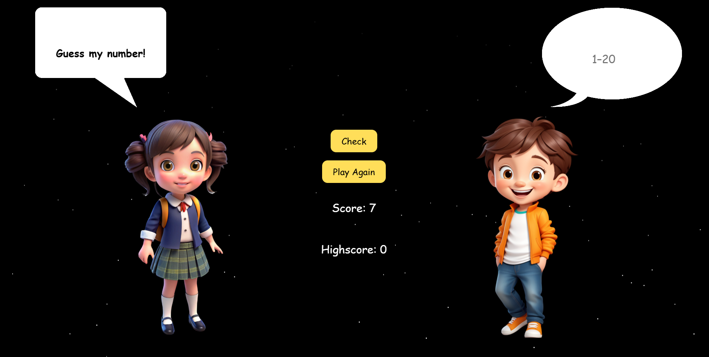

# 🎮 Guess My Number – Interactive Number Game

Welcome to **Guess My Number**, a fun and interactive number-guessing game built with **HTML, CSS, and JavaScript**!

Test your luck (or logic!) and try to guess the secret number between 1 and 20. The game includes sound effects, animated speech bubbles, and character reactions to keep things lively!

  

 

## 👉 [Click here to play the game](https://rashadul-islam-code.github.io/Guess_My_Number_Game/)

 

## 🧠 Features

- 🎯 Randomly generated secret number
- 🗣️ Talking characters with animated speech bubbles
- 💥 Game-over and win effects
- 🔊 Sound feedback for clicks, wins, and fails
- ✨ Animated star background
- 🧑‍💻 Mobile-friendly & responsive design

---

## 🔧 Technologies Used

- **HTML5**
- **CSS3 (Flexbox + Media Queries)**
- **Vanilla JavaScript**
- **Custom audio and visual assets**

---

## 📱 Responsive Design

The game layout and visuals adapt for smaller screens. Everything stays in place, just a little smaller — optimized for mobile without changing the structure.

---

## 🎮 🕹️ Enjoy the Game...

